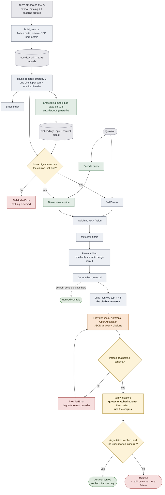

# compliance-mcp

[](https://github.com/QuilaguyPrime/compliance-mcp/actions/workflows/ci.yml)

*[Leer en espanol](README.es.md)*

An MCP server over the NIST SP 800-53 Rev 5 catalog, with hybrid retrieval,
citations verified against the corpus, and schema-validated output.

> **Status: work in progress (phase 4 of 5).** The retrieval numbers below come
> from a real run on the test split, recorded with provenance in
> `data/derived/ablation.json`. The generation numbers — citation fidelity,
> refusal behavior, cost per query — do not exist yet, and nothing here pretends
> otherwise. See [What is not measured yet](#what-is-not-measured-yet).

## What it does

Three MCP tools, ordered by how much they commit to what they say:

| Tool | What it returns |
| --- | --- |
| `search_controls` | Controls ranked by relevance. Pure retrieval, no generative model involved. Filters by family, baseline, kind, and withdrawn status. |
| `get_control` | One catalog record, whole and verbatim: statement, guidance, SP 800-53A assessment content, related controls, baselines, and references. Withdrawn controls included, with their successor. |
| `answer_question` | A written answer in which **every citation has been verified**, plus the retrieved controls and the full verification detail. |

## Architecture

The generative model touches exactly one step. Everything before it is
deterministic, and everything after it is a check that can overrule it.



Orange is the only generative step. Green is the embedding model, which is a
neural network but not a generative one: it encodes text into vectors and cannot
assert anything. Yellow are the checks, and two of them can discard the model's
output entirely.

Tuning constants, all read from `config.yaml`: BM25 `k1=1.5`, `b=0.75`;
`candidate_pool=100` per retriever; RRF `rrf_k=30` with weights `0.15` for BM25
and `1.0` for dense; parent roll-up `alpha=0.8`; generation context `top_k=5`.
Strategy C produces 2210 chunks over 324 base controls and 872 enhancements.

## The house rule: what does not verify does not get served

A citation is `(control_id, part, quote)`, and `quote` has to appear verbatim in
the text **that was shown to the model** — not in the corpus at large. The
difference matters: if a model reproduces, word for word, a real passage from
AC-2 that it was never shown, that is not a citation. That is parametric memory
that happened to be right.

Every citation gets a verdict: verified, control does not exist, real control
that was not in the context, quote not found in the control, part does not
exist, or quote too short to anchor anything. Whatever fails to verify is
dropped. If an answer ends up with no verified citation, or asserts things about
a control it cannot back, it becomes a refusal. Refusing is a valid outcome of
the system, not a failure of it.

That is why the hallucinated-citation rate on **served** answers is zero by
construction. Since that would turn the CI gate into a formality, the evaluation
separately measures the **raw** rate — over what the model emitted before the
policy discarded anything — and that is the one the gate enforces.

## Where every number comes from, and how you know it is not stale

The embeddings filename encodes only strategy and model. Change
`ingest.param_resolution_passes` or a chunking template, re-run ingest, and the
chunk TEXT changes but the chunk COUNT does not: the old `.npy` still loads, the
shapes still line up, and every vector now corresponds to text other than the
one it claims. No exception, no warning, and the evaluation publishes numbers
from an index that is not the one being served.

Three closures against that:

* **Index manifest.** At build time the fingerprint of the exact embedded text
  is stored. At load time it is recomputed and compared: mismatch means
  `StaleIndexError` and nothing gets served. Content fingerprint, not filename.
* **Provenance on results.** Every evaluation output carries the commit, the
  corpus digest, and the digest of the configuration that produced it. The CI
  gate compares that provenance against the current tree and rejects results
  from a different corpus or config: an old committed `ablation.json` no longer
  passes the gate without having measured anything.
* **What each digest covers.** `corpus_digest` fingerprints the ingested
  records. `config_digest` fingerprints the config sections that move the
  numbers — `ingest`, `chunking`, `retrieval` and `evaluation`, the last of
  which holds the split and bootstrap seeds. `golden_digest` fingerprints the
  golden set, which is the measuring instrument. `code_digest` fingerprints
  every `.py` under `src/`, with line endings normalised so a Windows checkout
  does not read as different code. The gate compares all four against the
  working tree and names the one that fails, because a failure that only says
  "provenance mismatch" leaves you to find out which.
* **What the digests deliberately do not cover.** Dependency versions.
  `pyproject.toml` declares ranges rather than pins, so hashing it would assert
  more than it can support: the same file installs different versions of
  `sentence-transformers` on two machines and produces different embeddings.
  The correct instrument is a lock file and this repository does not have one —
  the flank is open, and stated here rather than left to be discovered.
* **Why `code_digest` and not just the commit.** An artifact under
  `data/derived/` is versioned, so committing it creates a commit the artifact
  cannot name: it records the commit it was produced at, which is the parent of
  the one that contains it. `code_digest` does not have that problem, because
  writing a JSON file changes no `.py`. The commit sha stays as the human
  pointer into history; the digest is what the gate enforces.
* **Preflight** (`make doctor`). Checks corpus, index freshness, golden set
  consistency, installed extras, and credential presence, without calling any
  API. `--require` narrows which checks decide the exit code, so each CI job
  demands exactly what it is about to use.

## How to run it

### With Docker

The image ingests the OSCAL catalog, builds the index, and bakes in the
embedding model, so there is no setup step and no network access at run time.

**Target platform is `linux/amd64`,** declared in `docker-compose.yml` rather
than in the Dockerfile. That is the architecture anyone evaluating this will run
and the one CI uses; pinning it in the Dockerfile would also force emulation
when building on the Apple Silicon machine this is developed on, so the build
stays native there while the intent is still recorded.

Measured on a first build with a cold cache, `linux/arm64` native: **2.73 GB**
in 12 layers, **8 min 28 s**. Almost all of it is the runtime the server needs
rather than anything this project ships — 1.41 GB of virtualenv, of which torch
alone is 656 MB, plus 439 MB of embedding weights. The corpus and all three
indexes together are 21 MB, which is why they are baked in rather than mounted.

**The image serves; it does not evaluate.** `git` is not installed in the
runtime stage, so `git_sha` resolves to `None` inside a container and any
evaluation artifact produced there would carry provenance that cannot be traced
to a commit. Run `make eval` and `make eval-generation` from a clone, not from
the image.

```bash
cp .env.example .env                      # then fill in the keys
docker compose build                      # ingest + index happen here
docker compose run --rm doctor            # preflight, no network
docker compose run --rm compliance-mcp    # MCP server over stdio
```

The transport is stdio, so the server is used with `docker compose run`, not
`docker compose up`. Under `up` nothing is attached to stdin, the process reads
EOF and exits; that looks like a crash and is not one.

Registered in an MCP client:

```json
{
  "mcpServers": {
    "compliance": {
      "command": "docker",
      "args": ["run", "--rm", "-i", "--env-file", "/path/to/repo/.env",
               "compliance-mcp:0.1.0"]
    }
  }
}
```

The `-i` is not optional: without it the container gets no stdin and the MCP
handshake never happens.

This Dockerfile was published and carried an explicit "unverified" marker for
as long as no container runtime was available to build it, and the marker was
removed only once the image had been built, started, and checked. The first
build surfaced nothing that the file got wrong; the marker was there because
that could not be known in advance.

### Locally

```bash
make install-serve          # core + dense index + providers
make ingest index           # OSCAL corpus -> records -> hybrid index
cp .env.example .env        # then fill in the keys
make doctor                 # preflight, no network
make serve                  # MCP server over stdio (runs preflight first)
```

Registered in an MCP client:

```json
{
  "mcpServers": {
    "compliance": {
      "command": "/path/to/repo/.venv/bin/python",
      "args": ["-m", "compliance_mcp.server"],
      "env": { "ANTHROPIC_API_KEY": "sk-ant-..." }
    }
  }
}
```

The index is built once at startup and reused across requests. Logs go to stderr
as JSON, with one `trace_id` per request threading through retrieval,
generation, and verification; stdout is left to the protocol.

## How it is evaluated

```bash
make eval                                  # retrieval ablation (test split)
make eval-generation                       # generation with the real chain (spends API)
PROVIDER=extractive make eval-generation   # the floor: offline baseline
```

The golden set is 60 hand-written cases: 30 answerable ones stratified by query
style, 15 where refusing is the only correct answer, and 15 adversarial. The
train/test split is deterministic by hash of the case id; hyperparameters are
tuned on train only, and test is what gets reported.

Generation evaluation measures three things that are worth not mixing: raw
citation fidelity, refusal behavior (refusal recall **and** false refusal rate,
which have to be read together, because always refusing scores 1.0 on the
first), and quantities asserted without a source. The extractive baseline
copies, so its citation precision is 1.0 by construction rather than by merit:
it is never injected as evidence into the gate.

The golden set's `must_not_invent` field is written as prose criteria for a
human, not as a comparable string. It is not checked automatically: those cases
are dumped into the `manual_review` block of `data/derived/generation.json` for
human adjudication.

Cost per query is computed from the tokens the provider reports and the prices
in `config.yaml`, which carry a verification date. A model with no declared
price yields cost `None`, not zero: zero is a number, and it ends up summed into
a total that looks measured.

### What the CI gate actually enforces

`min_recall_at_5` is 0.60 against a measured 0.8636. The slack is deliberate.
With n=22 a single case is worth 0.0455 and the 95% interval runs from 0.7273 to
1.0000, so a threshold set close to the measurement would fail on sampling noise
every time one case moved, and a gate that fails while nothing is broken gets
switched off. At 0.60 it detects catastrophic regression — a stale index, a
misweighted fusion, a corpus that no longer matches — not marginal quality. For
marginal quality the confidence intervals in `ablation.json` are the instrument.

The strict gate is `min_citation_precision: 0.95` with
`max_hallucinated_citation_rate: 0.0`, enforced on raw model output before the
policy discards anything. Neither has ever run: both depend on the generation
evaluation, which costs API spend and is still pending. A gate that cannot fail
today is information rather than embarrassment — it states precisely which part
of the system is measured and which is not.

### Which chunking strategy is served, and what that costs

The served configuration is strategy C with hybrid retrieval
(`chunking.active: C`, `retrieval.method: hybrid`). Strategy A is one chunk per
control; C is one chunk per part, each carrying an inherited hierarchy header.
On the test split, `data/derived/ablation.json` scores 22 answerable cases:

| Strategy (hybrid) | recall@1 | recall@5 | MRR | nDCG@10 |
| --- | --- | --- | --- | --- |
| A | 0.4091 | 0.8182 | 0.6088 | 0.4976 |
| C (served) | 0.3636 | 0.8636 | 0.5780 | 0.4641 |

The trade-off runs in one direction: C finds more, A ranks better. C leads on
recall@5, while A leads on recall@1, MRR, and nDCG@10 — the three metrics that
reward putting the right control at the top rather than merely inside the
window.

**The mechanism is chunk granularity.** A emits one chunk per control, 1196 in
total; C splits each control by part and emits 2210. More and smaller units give
a query more distinct surfaces to match, which is what lifts the chance that the
right control lands somewhere inside the window. The ablation does not isolate
why the same split costs rank precision, so that direction is observed rather
than explained.

Choosing C follows from what the retrieval feeds. `generation.context.top_k` is
5, so all five retrieved controls are placed in the context in full; whether the
right one arrived first or fourth changes nothing about what the model can cite.
Under that consumer, recall@5 is the metric with a consequence and rank position
within the window is not.

That argument covers `answer_question` and not the whole server. `search_controls`
returns a ranked list to a human, who reads it top down and stops early, so
recall@1 and MRR do have a consequence there — and those are the metrics A leads
on. One strategy is served for both tools, so the choice optimizes the tool that
consumes a window and accepts the weaker ranking for the tool that does not.

**The data is consistent with that choice but does not establish it.** With
n=22, one case is worth 0.0455, and every gap here is one case: C retrieves
19/22 within the top 5 against A's 18/22, and A ranks 9/22 first against C's
8/22. The 95% bootstrap intervals overlap almost entirely — recall@5 is
[0.6364, 0.9545] for A and [0.7273, 1.0000] for C — so neither strategy is
shown to beat the other at this sample size. The honest reading is that the
choice rests on the `top_k = 5` argument, with the measurements failing to
contradict it rather than confirming it.

The isolated effect of the parent roll-up is the one comparison in the ablation
that is not marginal: on strategy C it moves recall@5 from 0.7273 to 0.8636,
which is three cases. The catalog holds 872 enhancements against 324 base
controls, and enhancements are short and specific enough to crowd the parent out
of the top-k.

### What is not measured yet

The real provider chain has never been run against the golden set, so **there
are no citation fidelity, refusal, or cost figures for the system as served**.
The only things measured end to end are retrieval and the extractive baseline.
The rest requires API spend and is deferred to phase 5: run the generation
evaluation, adjudicate the `manual_review` block by hand, and write the final
README with its confidence intervals.

## Configuration

`config.yaml` is the single source of truth. No numeric literal and no model
name lives in the code, and the loader fails loudly on a missing key rather than
falling back to a silent default: a silent fallback turns a configuration error
into a wrong evaluation result.

## Coherence tests

Two tests in `tests/test_repo_coherence.py` check the repository against itself.
The first is that every path the repo declares resolves to a file that exists:
the corpus and golden-set inputs in `config.yaml`, the `COPY` sources in the
Dockerfile, `build` and `env_file` in the compose file, `readme` and `packages`
in `pyproject.toml`, the `make` targets both READMEs document, and their
relative links. The second is that no committed artifact under `data/derived/`
carries a `-dirty` git sha anywhere in its provenance.

They exist because three separate failures during this project were the same
shape: state that did not match what was declared, and nothing raised at the
time. A stale index kept loading because the filename still matched after the
text behind it had changed. An evaluation artifact was published from a dirty
working tree, its own provenance recording the fact. A commit's Dockerfile
copied files that commit's tree did not contain, so the image it introduced
could not be built from it. A declaration that points at nothing is only found
by checking it, so these run in CI with the rest of the suite.

## License

MIT. Copyright (c) 2026 Juan Camilo Amaya Quilaguy. Full text in
[LICENSE](LICENSE).

The catalogs under `data/raw/` are NIST publications (SP 800-53 Rev. 5, in OSCAL
format) and are in the public domain; the MIT license covers this code, not that
source data.
